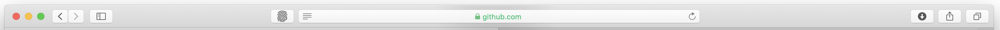

	
	<h1>Clean Links</h1>
	

		<b>What happens in your browser, stays in your browser.</b>
	

	 
	 
	 

This is a Safari App Extension, which strips all popular tracking query parameters off the links you click. No more `fbclid` or `gclid`!

# Requirements

The extension is available in macOS 10.12 and later.

# Installation

To install *Clean Links* you can either download the latest prebuild extension from the [releases](https://github.com/Sh1d0w/clean-links/releases) tab, or you can clone the repository and build it yourself.

After that double click on the extension to install it. Navigate to `Safari -> Preferences -> Extensions` and make sure *Clean Links* is enabled.

You should see the extension icon next to the url bar, indicating that the extension has been successfully activated.

# FAQ

### What tracking parameters does the plugin currently strips?

Tracking tokens from the following services are stripped:

- [UTM parameters](https://en.wikipedia.org/wiki/UTM_parameters) used by Google Analytics
- [DoubleClick Click Identifier](https://en.wikipedia.org/wiki/DoubleClick_Click_Identifier) (dclid), used by DoubleClick, now Google
- [Facebook Click Identifier](https://en.wikipedia.org/wiki/Facebook_Click_Identifier) (fbclid) used by Facebook in social media analytics
- [Google Click Identifier](https://en.wikipedia.org/wiki/Google_Click_Identifier) (gclid and gclsrc), used by Google Ads
- [Microsoft Click Identifier](https://en.wikipedia.org/wiki/Microsoft_Click_Identifier) (mscklid), used by Bing Ads
- [Zanox click identifier](https://en.wikipedia.org/wiki/Zanox_click_identifier) (zanpid), used by Awin
- Mailchimp (mc_eid)
- Yandex (_openstat)
- HubSpot (_hsenc, _hsmi)

# Roadmap

- [ ] Regularly add more tracking parameters to the blacklist
- [ ] Possibly publish the extension to the Mac App Store, in order to provide auto updates.
- [X] Escape tracking links as well, such as `l.facebook.com?l.php?u=http://yourlink,com` or email campaign tracking links and redirect to the actual link instead.
- [ ] Make the main app screen more user friendly
- [x] Make the toolbar icon show counter / stats of links that have been cleaned.

## Support

If this extension was useful to you or you want to support the project, I would be very grateful if you buy me a cup of coffee.

# Maintainers

- [Radoslav Vitanov](https://github.com/Sh1d0w)

# Resources

- Icon made by [Pixel perfect](https://www.flaticon.com/authors/pixel-perfect) from www.flaticon.com

## License

MIT